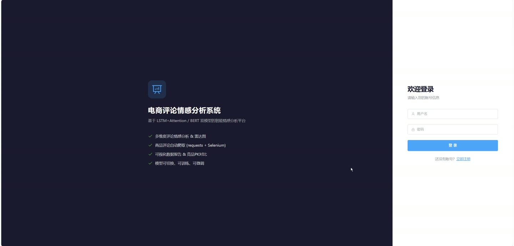
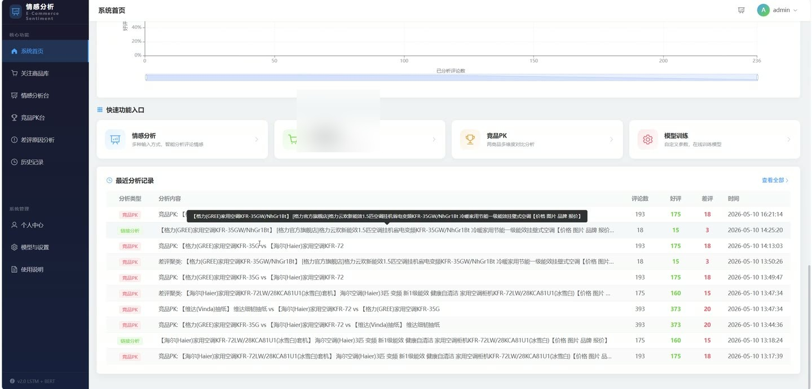
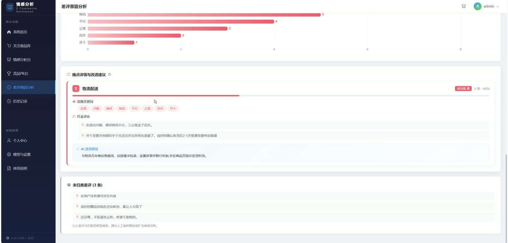
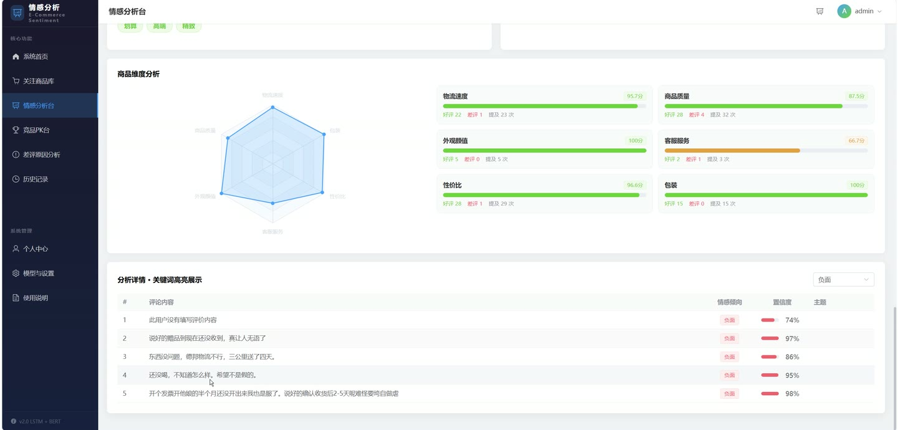
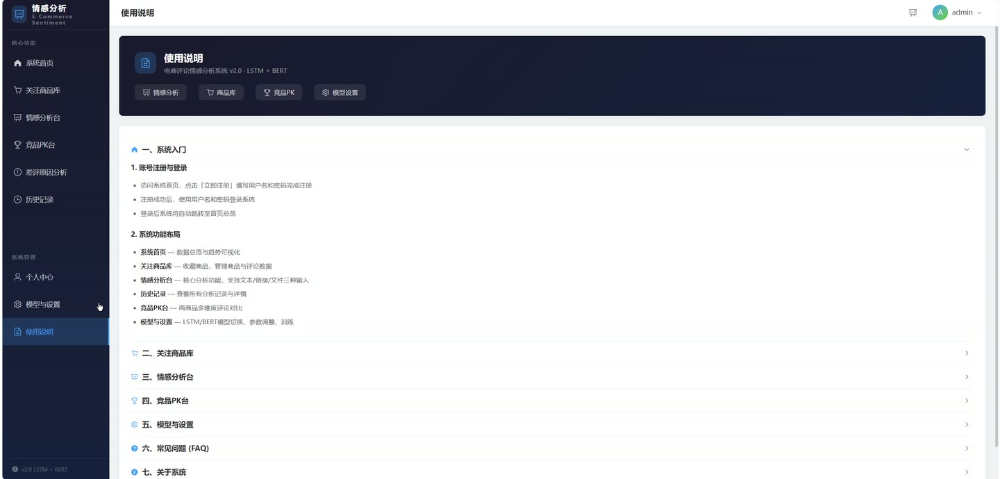
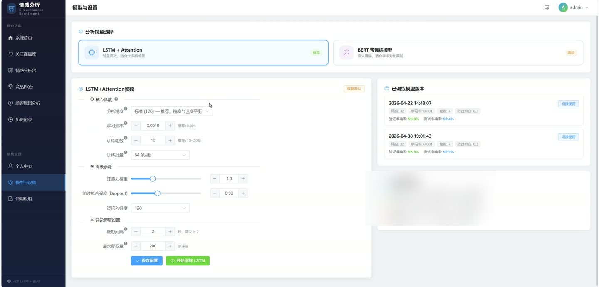

# (附文档)Python+深度学习+PyTorch 基于LSTM的电商评论情感分析

**技术栈**：Python、Django、PyTorch、深度学习、Vue3、MySQL

### 系统简介

本系统是一套基于 PyTorch 深度学习框架的电商评论情感分析平台，采用前后端分离架构，后端由 Django REST Framework 提供接口，前端使用 Vue3 构建交互界面。系统内置 LSTM+注意力机制情感分类模型，支持纯文本、商品链接、文件上传、竞品 PK 四种分析方式，并配备模型训练、版本切换、历史记录管理等能力，角色划分为普通用户端与管理员端。
 
### 核心功能
 
### 普通用户端

 
- 账号注册与登录：支持用户名密码注册、JWT 登录获取令牌、令牌刷新、修改密码、查看与编辑个人资料。 
- 纯文本分析：粘贴多条评论文本提交分析，自动过滤“此用户未填写评价内容”等空评论，返回正面/负面/中性数量与逐条置信度。 
- 商品链接分析：提交苏宁易购商品链接或已入库商品 ID，自动爬取评论并分析，同时提取主题标签、维度分析与情感汇总。 
- 文件上传分析：上传 CSV 或 Excel 文件，自动识别“评论内容/评论/content/review/text/内容”列名，批量分析并返回结果。 
- 维度分析：对分析结果按维度聚合，输出各维度情感倾向分布，辅助定位口碑短板。 
- 主题提取：对评论文本调用模型提取主题词，展示评论集中讨论的话题方向。 
- 结果导出：按记录 ID 导出分析结果，支持 CSV 与 Excel 两种格式，字段包含评论内容、情感倾向、置信度。 
- 商品库管理：添加苏宁商品链接自动爬取商品信息与评论，支持修改备注名称、批量删除、增量更新评论、按平台与关键词筛选。 
- 商品维度统计：查看单商品评分分布、情感占比、近 12 周评论趋势、词云、正面与负面高频关键词。 
- 商品评论列表：按情感倾向筛选商品评论，分页查看评论内容、评分、情感标签与置信度。 
- 竞品 PK 分析：支持 2-4 个商品对比，输出各商品好评率、差评率、平均置信度、五维雷达图、共同与独有关键词差异、加权综合评分与冠军结论。 
- 差评原因聚类：对商品或自定义文本筛选差评，按物流配送、商品质量、性价比、外观设计、客户服务、使用体验等维度归类，输出占比、优先级与改进建议。 
- 历史记录管理：按分析类型与状态筛选、按时间排序查看历史分析记录，支持查看详情、删除单条、批量删除。 
- 首页数据看板：展示商品总数、评论总数、分析次数、平均准确率、情感总览、近 7 天每日分析趋势与最近分析记录。 
- 模型参数配置：设置隐藏层神经元数量、学习率、批次大小、迭代次数、注意力权重、Dropout 率、词嵌入维度，并可一键恢复默认配置。 
- 模型训练：按当前配置在后台线程启动 LSTM 训练，实时轮询展示阶段、步数、Epoch、训练与验证损失及准确率。 
- 模型版本管理：查看已训练模型版本列表、当前活跃版本，并可将指定版本切换为当前使用模型。 
- 爬虫与可视化设置：配置爬虫请求间隔、最大爬取数据量、图表主题与默认导出格式。 
- 个人数据统计：查看名下商品数量、分析次数、累计分析评论数与累计分析次数。
 
### 管理员端

 
- 后台登录：通过 Django Admin 入口使用管理员账号登录后台。 
- 用户管理：查看、编辑、禁用平台用户账号，管理用户名、手机号、头像等字段。 
- 商品管理：查看与维护全平台商品记录，包括商品名称、备注、链接、平台、价格、评论数量。 
- 评论管理：查看与维护评论内容、评分、情感倾向、置信度、主题标签、是否已分析等字段。 
- 分析记录管理：查看全平台分析记录的类型、输入摘要、状态、正负中性数量、使用模型与时间。 
- 模型配置管理：查看与维护各用户的模型超参数、爬虫参数与可视化设置。
 
### 技术栈

 后端框架Python + Django + Django REST Framework 深度学习框架PyTorch（LSTM + 注意力机制） 文本处理jieba 分词、Word2Vec 词向量、自定义停用词表 主题与维度分析SimpleTopicExtractor 维度词典、LDA 主题提取 身份认证JWT（djangorestframework-simplejwt） 数据筛选django-filter、SearchFilter、OrderingFilter 数据处理pandas、openpyxl、scikit-learn 前端框架Vue3 数据库MySQL 数据采集苏宁易购评论爬虫（含限流控制）
 
### 交付内容

 
- 后端完整源码 
- 前端完整源码 
- 数据库初始化脚本 
- 万字文档

## 界面展示

---

## 获取完整源码 + 万字文档

本仓库为项目介绍页。**完整前后端源码、数据库初始化脚本、万字项目文档**，请加微信 `kangkangcode`，或访问 [codekk.top](http://codekk.top) 获取。

可作课程设计 / 毕业设计参考，支持远程部署调试。